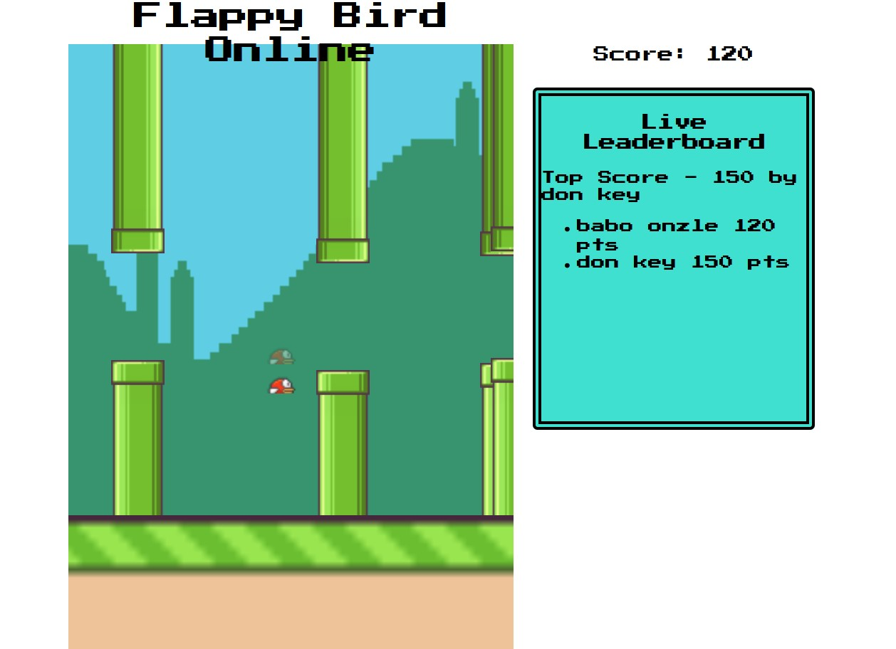

# Flappy Bird Multiplayer
**So, finally came back to this [one](https://www.youtube.com/watch?v=gxHcW84izz0&t=201s) and completed [part 2](https://www.youtube.com/watch?v=ReGHyTh1ydU) of the series.**

 <em>Sample screenshot</em> 

**This game works only on desktop browsers and is constrained by the free limitations.**

*Most of the game arts/images are taken from cs50 intro to game development*

## Learnings
While part 1 (ba @ania) showed how to build a desktop browser version of Flappy Bird in pure javascript, part2 shows how to use Nodejs packages to make it a multiplayer, specifically making use if the Ably API. There was a lot to follow here, and a lot of troublehooting to be done.
- Use concept of channels between client and server to share/sync up data

## ToDo
- [ ] Provide an input field for nicknames, and update accordingly
- [ ] Save previous nickname to local storage and load on next session
- [ ] Remove other sprite when game over
- [ ] Maybe look for `Ably` alternatives with lesser restrictions on messages (?)
- [ ] Accelerate obstacle generation over time